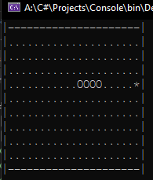

# Змейка (Snake Game) на C#
Это созданное в учебных целях консольное приложение на языке программирования C#, реализующее игру "Змейка". Это простая игра, где игрок управляет змейкой, съедая еду и увеличивая свой размер, при этом избегая столкновения со стенами или своим хвостом.

Игрок управляет змейкой, используя клавиши управления (вверх, вниз, влево, вправо) на клавиатуре. Змейка движется по игровому полю, и игрок должен собирать еду, которая случайным образом появляется на поле. При съедании еды змейка увеличивает свой размер. Игра заканчивается, если змейка сталкивается со стеной или со своим хвостом.

По умолчанию, игровое поле имеет размер 21 на 9 клеток. Однако, вы можете нарисовать свое поле как хотите, изменив значение map в классе Program. К примеру, сейчас оно выглядит следующим образом:
```
|---------------------|
|.....................|
|.....................|
|.....................|
|.....................|        
|.....................|
|.....................| 
|.....................| 
|.....................|
|.....................|
|---------------------|
```

Где "." - пустое поле, "-" и "|" - стены. Еда будет представлена как "*", а тело змейки как "О".

# Скриншоты

